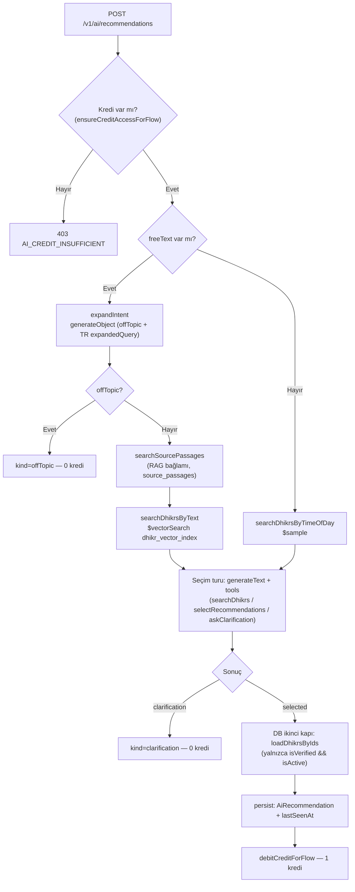
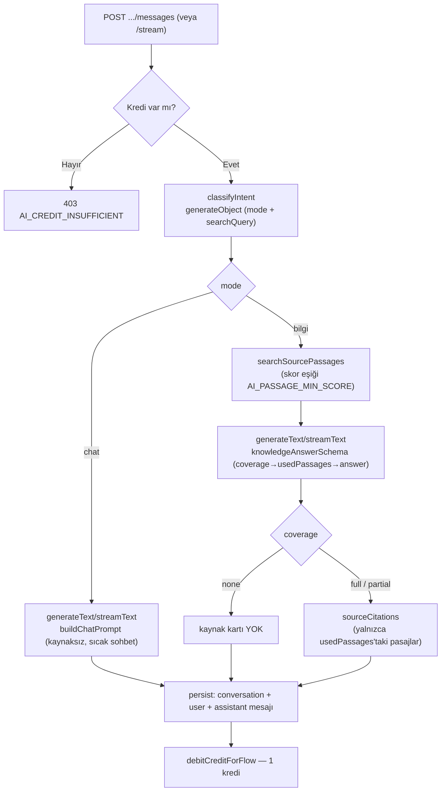

# AI Mimarisi (Salt-AI Pipeline)

Bu doküman Zikirmatik API'sindeki **AI Rehber** (zikir önerisi) ve **AI Sohbet**
(kaynak asistanı) akışlarının güncel mimarisini anlatır. İkisi de aynı alt
yapıyı (`AiRuntimeService`, `RetrievalService`, `AiCreditsService`,
`AiUsageService`, `AiPipelineExceptionFilter`) paylaşır ama ayrı ajanlardır.

İlgili kod: `apps/api/src/modules/ai/*`, `apps/api/src/modules/ai-chat/*`.

---

## 1. Amaç ve İlkeler

- **Salt-AI, fallback YOK.** Eski kategori/keyword eşleştirme, `recommendation_cache`
  ve "fallback modeli" akışları tamamen kaldırıldı. Öneri de, sohbet cevabı da
  yalnızca LLM çağrısının başarılı sonucudur.
- **Hata → açık 503, kredi yok.** `RecommendationAgentService`, `AiService` veya
  `AiChatService` içindeki herhangi bir adım (embedding, `$vectorSearch`,
  `generateObject`/`generateText`/`streamText`) başarısız olursa akış
  `AiPipelineError` fırlatır; bu hata hiçbir yerde yutulup sessiz bir cevaba
  dönüştürülmez. Kullanıcı her zaman aynı güven verici mesajla 503
  `AI_UNAVAILABLE` alır ve **kredisi düşülmez**.
- **Sessiz uydurma cevap yok.** AI Rehber'de model yalnızca kendisine verilen
  aday referanslarını (`C1`, `C2`, …) kullanabilir; ham ObjectId veya
  referans kodu kullanıcıya asla sızmaz (`stripModelRefs`). AI Sohbet'in
  `bilgi` modunda cevap yalnızca gömülü kaynak pasajlarına dayanabilir;
  pasaj yoksa/ilgisizse model bunu açıkça söylemek zorundadır (`coverage:'none'`).

---

## 2. AI Rehber Akışı

Giriş noktası: `AiService.createRecommendation` (`POST /v1/ai/recommendations`).
LLM/agent mantığının tamamı `RecommendationAgentService.run`'da.



Herhangi bir adımda `AiPipelineError` fırlarsa (embedding hatası, boş aday
listesi, model geçersiz çıktı vb.) akış `AiPipelineExceptionFilter`'a düşer →
**503 `AI_UNAVAILABLE`, 0 kredi** (diyagrama ayrıca çizilmedi, her kutudan
çıkabilir).

### 2.1 Niyet genişletme (`expandIntent`)

- Yalnızca `freeText` doluysa çalışır. `generateObject` + `expandIntentSchema`
  (`{ offTopic: boolean, expandedQuery: string }`).
- `expandedQuery` **her zaman Türkçe** üretilir (kullanıcı İngilizce yazsa
  bile) — arama korpusu (zikir kataloğu + kaynak pasajları) Türkçe olduğu için.
- `offTopic=true` ise agent hiçbir aday aramadan `kind:'offTopic'` döner.

### 2.2 Aday zikir + kaynak pasajı çekme (deterministik, LLM'siz)

- `freeText` varsa: `RetrievalService.searchSourcePassages` (RAG bağlamı,
  `AI_RAG_PASSAGE_LIMIT`) ve `searchDhikrsByText` (`$vectorSearch`
  `dhikr_vector_index`, `AI_CANDIDATE_LIMIT`, son 7 günde gösterilen
  zikirler `getRecentDhikrIds` ile dışlanır).
- `freeText` yoksa (zaman tabanlı genel öneri): `searchDhikrsByTimeOfDay`
  (`$sample` ile rastgele örnekleme — **artık `recommendedCount`'a göre
  sıralanmıyor**, bkz. §6).
- Aday listesi boşsa `AiRetrievalError('retrieval_failed')` → 503.

### 2.3 Tek seçim turu (`runSelectionStep`)

`generateText` + üç araç, `withAiRetry('select', …)` ile sarılı (varsayılan
2 deneme = 1 tekrar, yalnızca retryable hatada).

| Araç | Sınır | Ne zaman aktif |
|---|---|---|
| `searchDhikrs` | en fazla **1 kez** | yalnızca ilk adımda (`searchUsed=false`) |
| `selectRecommendations` | — | her zaman |
| `askClarification` | — | yalnızca `searchDhikrs` **kullanıldıktan sonra** |

`prepareStep` bu kapılamayı uygular: ilk adımda `{searchDhikrs,
selectRecommendations}` (`toolChoice:'required'`); `searchDhikrs`
çağrıldıktan sonra `{selectRecommendations, askClarification}`. Yani
`askClarification` yalnızca "arama sonrası da hiçbir aday uymuyorsa"
erişilebilir bir araçtır — ilk turda modelin doğrudan netleştirme sorması
mümkün değildir. `stopWhen: [stepCountIs(3), () => outcome !== null]`.

- **Halüsinasyon reddi:** Model yalnızca aday listesindeki `C#` referanslarını
  kullanabilir (`selectRecommendations.items[].ref`); ham ObjectId üretmesi
  prompt'ta açıkça yasaklanır. `AiService.stripModelRefs` metne sızan
  ObjectId/`C#` kalıntılarını ikinci bir savunma hattı olarak temizler.
- **DB ikinci kapı:** Seçilen `ref → id` eşlemesi sonrası `loadDhikrsByIds`
  yalnızca `isVerified && isActive` kayıtları döner; hiçbiri doğrulanamazsa
  `AiInvalidOutputError`.

### 2.4 Cevap türleri ve kredi

| `kind` | Açıklama | Kredi |
|---|---|---|
| `offTopic` | Niyet İslami zikir/dua bağlamıyla ilgisiz | **0** |
| `clarification` | Model tek netleştirme sorusu sordu (`suggestedCategories:[]` legacy alanla birlikte) | **0** |
| `recommendations` | Seçim başarılı, persist edildi | **1** |
| AI hatası (`AiPipelineError`) | 503 `AI_UNAVAILABLE` | **0** |

---

## 3. AI Sohbet Akışı

Giriş noktaları: `AiChatService.createConversation` / `sendMessage` (REST) ve
`streamCreateConversation` / `streamSendMessage` (SSE, `POST
/v1/ai/chat/conversations/stream` ve `.../messages/stream`). Dört metod da
aynı ajan mantığını (`runChatAgent` / `runChatAgentStream`) çağırır.



### 3.1 Niyet sınıflandırma (`classifyIntent`)

- `generateObject` + `classifyIntentSchema` (`{mode:'chat'|'bilgi',
  searchQuery}`), son 5 turluk konuşma kuyruğuna bakar.
- `mode`: kararsız kalınca **`bilgi`** seçilir (gereksiz arama zararsız, eksik
  arama cevabı zayıflatır).
- `searchQuery`: takip sorularını ("peki ya sigara?") bağlamdan bağımsız
  anlaşılır bir sorguya çevirir; boş/eksik dönerse ham son kullanıcı mesajına
  düşülür (yalnızca retrieval kalitesi için — hata toleransı DEĞİL).

### 3.2 `bilgi` modu — kaynak araması + yapılandırılmış cevap

- `RetrievalService.searchSourcePassages(searchQuery, AI_CHAT_PASSAGE_LIMIT)`
  — `source_passages_vector_index` üzerinde salt vektör arama, skor
  `AI_PASSAGE_MIN_SCORE` (varsayılan 0.68) altındakiler elenir.
- Cevap artık serbest metin değil, `knowledgeAnswerSchema` ile yapılandırılmış:
  `coverage` (`full`/`partial`/`none`) → `usedPassages` (`["P2","P4"]`) →
  `answer`. **Alan sırası bilinçli**: `answer` en son dolduğu için
  `streamText().partialOutputStream` üzerinden token-token akıtılabilir.
- **Kaynak kartı yalnızca kullanılan pasajlardan** kurulur
  (`buildSourceCitations`): modelin `usedPassages` alanında işaretlediği
  ref'ler dışındakiler asla karta girmez; tanınmayan ref'ler (`P9` gibi
  uydurma) sessizce düşürülüp loglanır. `coverage==='none'` ise kart hiç
  yok. `coverage!=='none'` ama geçerli ref bulunamazsa (model tutarsız
  davranmışsa) `coverage` `'none'`'a düşürülür — dayanaksız bir "full"
  asla gösterilmez.

### 3.3 `chat` modu

- Kaynak araması yapılmaz. `buildChatPrompt` modelin dini bilgi/hüküm/
  zikir-dua içeriği **uydurmasını açıkça yasaklar**; kullanıcı bir bilgi
  sorusu sorarsa bir sonraki turda `bilgi` moduna düşecek şekilde soruyu
  netleştirmesini ister.

### 3.4 Persist ve kredi

- Persist sırası kritik: konuşma/mesaj kayıtları **agent BAŞARIYLA
  tamamlanmadan hiç yaratılmaz**. Hata olursa yarım kalmış kayıt olmaz.
- Kredi yalnızca persist başarılıysa düşülür (`debitCreditForFlow`,
  `AI_CREDIT_REASONS.CHAT_MESSAGE_DEBIT`) — `chat` ve `bilgi` modları
  arasında kredi farkı yoktur (ikisi de 1 kredi); AI Rehber'deki
  offTopic/clarification gibi "0 kredi" ara durumu AI Sohbet'te yok, çünkü
  sınıflandırma/arama başarısızlığı zaten `AiPipelineError` olarak üst
  katmana çıkar.

### 3.5 SSE event sözleşmesi

`streamCreateConversation` / `streamSendMessage`:

- `event: token` × N — `{ delta }` (yalnızca `answer` alanının büyüyen kısmı;
  `bilgi` modunda `partialOutputStream`, `chat` modunda ham `textStream`).
- `event: done` — `{ messageId, content, remainingCredits, conversationId,
  mode, coverage, sourceCitations }`.
- `event: error` — `{ code, reason?, requestId, message }`; `code` her zaman
  `AI_UNAVAILABLE` (`AiPipelineError`) veya `INTERNAL` (beklenmeyen hata),
  mesaj her zaman `AI_UNAVAILABLE_MESSAGE[locale]` (gerçek neden sızmaz).
- İstemci bağlantıyı keserse (`abortSignal`) hata sınıflandırılır ama
  yalnızca loglanır, `error` event'i yazılmaz ve persist/debit atlanır.

---

## 4. Hata Sınıflandırması ve Retry Politikası

`apps/api/src/modules/ai/ai-errors.ts` — tüm AI hataları tek bir
`AiPipelineError` ailesine normalize edilir (`classifyAiError`).

| `AiFailureReason` | Retryable | Örnek kaynak |
|---|---|---|
| `not_configured` | Hayır | `OPENAI_API_KEY` eksik |
| `timeout` | Evet | `AbortError`/`TimeoutError`/mesajda "timeout" |
| `rate_limited` | Evet | `APICallError` statusCode 429 |
| `provider_error` | Değişken | 5xx → evet; 401/403/diğer 4xx → hayır; statusCode yoksa SDK'nın kendi `isRetryable`'ı |
| `invalid_output` | Evet | `NoObjectGeneratedError`, `InvalidToolInputError`, `JSONParseError`, `TypeValidationError`, boş/şemasız model çıktısı |
| `embedding_failed` / `retrieval_failed` | Evet | embed veya `$vectorSearch` hatası |
| `stream_interrupted` | Hayır | ilk token akıtıldıktan SONRA stream koptu |

**Retry politikası (`AiRuntimeService.withAiRetry`):** varsayılan 2 deneme
(= 1 tekrar), yalnızca `error.retryable && canRetry()` ise. Bu, her
`generateText`/`generateObject`/`streamText` çağrısının kendi SDK-seviyeli
`maxRetries:1` ayarının (bkz. §5) **üzerine** eklenen ayrı bir agent/adım
seviyeli tekrar katmanıdır. Stream'lerde `canRetry = () => !anyTokenSent` —
**kullanıcıya en az bir token akıtıldıktan sonra asla tekrar denenmez**;
böyle bir kopma `AiStreamInterruptedError` (retryable=false) olarak
fırlatılır.

**HTTP karşılığı** (`AiPipelineExceptionFilter`, `@Catch(AiPipelineError)`):
her zaman **503**, gövde `{ code:'AI_UNAVAILABLE', reason, requestId,
message }`. SSE akışı zaten başlamışsa (`res.headersSent`) gövde
değiştirilemez, yalnızca loglanır — bu durumda hata bilgisi SSE
`event:error` üzerinden gider (bkz. §3.5).

---

## 5. Modeller ve Env Değişkenleri

Kaynak: `apps/api/src/modules/ai/ai-runtime.service.ts`,
`apps/api/.env.example`.

| Değişken | Varsayılan | Ne için |
|---|---|---|
| `AI_SELECT_MODEL` | `gpt-5` | AI Rehber seçim/araştırma turu |
| `AI_CHAT_MODEL` | `gpt-5` | AI Sohbet `chat` + `bilgi` üretimi |
| `AI_CLASSIFY_MODEL` | `gpt-5-mini` | Sohbet `classifyIntent` |
| `AI_EXPAND_MODEL` | `gpt-5-mini` | Rehber `expandIntent` |
| `AI_SELECT_REASONING_EFFORT` | `minimal` | yalnız `select` reasoning modeliyse |
| `AI_CHAT_REASONING_EFFORT` | `low` | yalnız `chat` reasoning modeliyse |
| *(classify/expand reasoning effort)* | `minimal` | env'den değil, sabit |
| `AI_SELECT_TIMEOUT_MS` | `30000` | |
| `AI_CHAT_TIMEOUT_MS` | `45000` | |
| `AI_CLASSIFY_TIMEOUT_MS` | `8000` | |
| `AI_EXPAND_TIMEOUT_MS` | `8000` | |
| `AI_PASSAGE_MIN_SCORE` | `0.68` | `source_passages` vektör arama alt eşiği (`0` = eşik kapalı) |
| `AI_CANDIDATE_LIMIT` | `15` (kod tavanı 20) | Rehber aday zikir sayısı |
| `AI_RAG_PASSAGE_LIMIT` | `4` | Rehber bağlamı için pasaj sayısı |
| `AI_CHAT_PASSAGE_LIMIT` | `6` | Sohbet `bilgi` modu pasaj sayısı |
| `OPENAI_EMBEDDING_MODEL` | `text-embedding-3-large` | tüm embedding'ler (dhikr + pasaj, `EmbeddingService`) |
| `AI_MODEL_PRICES_JSON` | *(boş)* | `ai-cost-report.mjs` için liste fiyatı override'ı |

Maksimum çıktı token'ları (`AiRuntimeService`, env'den değil sabit):
`select`=3000, `chat`=2500, `classify`=800, `expand`=800.

**Not — reasoning model ayrımı:** `gpt-5*` (`gpt-5-chat` hariç) ve
`o1`/`o3`/`o4` "reasoning model" sayılır (`isReasoningModel`). Bu modellerde
`temperature` **desteklenmez**; onun yerine
`providerOptions.openai.reasoningEffort` + `textVerbosity:'low'` gönderilir.
Reasoning modeli olmayanlarda ise `temperature: 0` kullanılır — ikisi asla
birlikte gönderilmez.

---

## 6. Veri

- **Zikir kataloğu:** 541 doğrulanmış zikir/dua (`isVerified && isActive`
  filtresiyle sorgulanır). Anlamsal arama `dhikr_vector_index` Atlas
  $vectorSearch index'i üzerinden yapılır — **index tanımı kodda değil,
  yalnızca Atlas'ta** (manuel oluşturulur/güncellenir).
- **Kaynak pasajları (`source_passages`):** kitap/siyer/ilmihal RAG
  korpusu. Arama `source_passages_vector_index` ile yapılır, index
  `apps/api/scripts/create-source-passage-index.mjs` ile oluşturulur.
  Aynı `RetrievalService.searchSourcePassages` metodu hem AI Sohbet'in
  `bilgi` modu hem de AI Rehber'in RAG bağlamı tarafından paylaşılır.
  Yeni kaynak ekleme akışı için bkz.
  [`docs/kaynaklar/KAYNAK-EKLEME-REHBERI.md`](kaynaklar/KAYNAK-EKLEME-REHBERI.md).
- **Hibrit arama (`AI_HYBRID_SEARCH`, varsayılan `'1'`):** Faz 4'ten
  itibaren `RetrievalService.searchSourcePassages` ve
  `searchDhikrsByText`, `$vectorSearch`'e paralel olarak Atlas Search
  (full-text, `lucene.turkish` analyzer) sorgusu da çalıştırır ve iki
  listeyi **Reciprocal Rank Fusion** (RRF, `k=60`,
  `apps/api/src/modules/ai/retrieval-fusion.ts`) ile birleştirir. RRF her
  listedeki 1-indeksli sıraya göre `1/(k+rank)` katkısı verir; bir öğe
  her iki listede de geçiyorsa katkılar toplanır (doğal "both" boost'u).
  - **İki farklı full-text mekanizması (kasıtlı asimetri):**
    - **Kaynak pasajı bacağı** Atlas Search kullanır:
      `source_passages_text_index` (`source_passages`, alanlar: `text`,
      `sectionHeading`, `sourceTitle`, `sourceId`, analyzer
      `lucene.turkish`), `apps/api/scripts/create-text-search-indexes.mjs`
      ile (idempotent, `--wait` ile queryable olana kadar bekler)
      oluşturulur.
    - **Zikir bacağı** standart Mongo `$text` index kullanır:
      `dhikr_text_idx` (`dhikrs`, alanlar:
      `name.tr`/`transliteration.tr`/`meaning.tr`/`virtue.tr` +
      `tags`/`suitableFor`/`categories`, `default_language: 'turkish'`,
      isim/transliterasyon ağırlıklı `weights`). Index tanımı
      `dhikr.schema.ts`'te `DhikrSchema.index(...)` ile kodda tutulur (app
      `autoIndex:true` ile açılışta da oluşturabilir) ve ayrıca
      `apps/api/scripts/create-dhikr-text-index.mjs` ile idempotent olarak
      garanti edilir. **Neden Atlas Search değil:** cluster'ın Atlas
      Search (FTS) index kotası dolu — 2 mevcut $vectorSearch index'i
      (`dhikr_vector_index`, `source_passages_vector_index`) +
      `source_passages_text_index` kotanın tamamını kullanıyor;
      `dhikr_text_index` (Atlas Search) oluşturma denemesi "The maximum
      number of FTS indexes has been reached for this instance size."
      hatası vermişti. Standart Mongo `$text` index'i bu kotadan tamamen
      bağımsızdır ve `runDhikrTextSearch`'te `$match: { $text: { $search,
      $language: 'turkish' } }` ile sorgulanır (bir aggregate
      pipeline'ında `$text` yalnızca İLK `$match` aşamasında
      kullanılabilir). Kaynak ekleme/kaldırma her iki index tanımını da
      asla etkilemez, ikisi de dinamik değildir (sabit alan listesi), yeni
      bir kaynak/zikir eklemek için ekstra bir adım GEREKMEZ.
  - **Zayıf metin eşleşmesi göreli eşiği (`AI_TEXT_MIN_REL_SCORE`,
    varsayılan `0.35`):** her iki bacakta da, metin leg'i döndükten sonra
    skoru o leg'in EN İYİ skorunun bu orandan daha azı olan öğeler RRF'ye
    girmeden önce elenir (`RetrievalService.applyTextRelativeFloor`).
    Amaç: sorgunun yalnızca ortak/yaygın bir kelimeyi (örn. "duası")
    paylaştığı, anlamsal olarak ilgisiz zayıf eşleşmeleri bastırmak.
    Elenen adet `flowLog.debug` ile loglanır.
  - **Eşik politikası (yalnızca `searchSourcePassages`, minScore/
    `AI_PASSAGE_MIN_SCORE`):** göreli eşikten sağ çıkan bir pasaj metin
    eşleşmesi (keyword hit) taşıyorsa, `AI_PASSAGE_MIN_SCORE` vektör
    eşiğinin altında olsa bile ELENMEZ — hibrit aramanın amacı tam olarak
    vektörün kaçırdığı isim/transliterasyon eşleşmelerini yakalamaktır.
    Metin eşleşmesi olmayan bir öğe eskisi gibi eşiğe tabidir.
  - **Degrade davranışı:** kaynak pasajı bacağında metin index'i henüz
    `queryable` değilse Atlas tipik olarak `$search` aşamasından HATA
    FIRLATMAZ, sessizce boş sonuç döner — akış doğal biçimde vektör-only'e
    düşer. Zikir bacağında (`$text`) index yoksa Mongo "text index
    required for $text query" hatası fırlatır. Her iki durumda da (Atlas'ın
    nadiren fırlattığı "index not found" exception'ı dahil) bu AI hatası
    SAYILMAZ: `RetrievalService` process başına index başına en fazla bir
    kez `flowLog.warn` basar ve vektör-only sonuçla devam eder. Farklı bir
    hata (index eksikliğiyle ilgisiz) her zamanki gibi
    `AiRetrievalError('retrieval_failed')` olarak yükselir.
  - `AI_HYBRID_SEARCH=0` davranışı, hibrit kod eklenmeden ÖNCEKİ
    pipeline'larla bayt bazında birebir aynıdır (regresyon güvencesi).
- **`recommendedCount`** (Dhikr şeması): mobilde "bu zikir kaç kez
  çekilecek" statik tekrar hedefi. **Artık bir sıralama/popülerlik sinyali
  DEĞİL** — zaman tabanlı genel öneri artık bu alana göre değil `$sample`
  (rastgele örnekleme) ile seçiliyor.
- **`selectionCount`** (Dhikr şeması): `PATCH
  /v1/ai/recommendations/:id/select` ile artan gerçek kullanıcı seçim
  sayacı — `recommendedCount` ile karıştırılmamalı, salt telemetri amaçlı.

---

## 7. Gözlemlenebilirlik

- **Log öneki:** `AiRuntimeService.flowLog(flowId)` her satırı
  `[flow=xxxxxxxx]` (flowId'nin ilk 8 karakteri) ile başlatır; AI Rehber ve
  AI Sohbet'teki tüm adım logları bu öneki paylaşır — tek bir isteğin uçtan
  uca izini sürmek için kullanılır.
- **`ai_usage_log` koleksiyonu** (`AiUsageService.record`, asla akışı
  bloklamayan fire-and-forget bir kayıt): her `generateText`/
  `generateObject`/`streamText`/embedding çağrısı için `kind` ∈
  `recommend | chat | chat_stream | classify | expand | embedding`,
  `model`, `inputTokens`/`outputTokens`/`totalTokens`, `steps`, ve
  `ai-pricing.constants.ts`'teki liste fiyatlarından hesaplanan
  `estCostUsd`.
- **`apps/api/scripts/ai-cost-report.mjs`** — `ai_usage_log`'dan maliyet
  raporu üretir; kredi ekonomisi takibi için bkz.
  [`docs/ai-kredi-birim-ekonomi-takip.md`](ai-kredi-birim-ekonomi-takip.md).
- **Eval harness (geliştiriliyor):** `pnpm --filter api eval:rehber` /
  `eval:chat` (bkz. `apps/api/scripts/eval/README.md`).

---

## 8. Operasyon Notları

- **`recommendation_cache` koleksiyonu artık kullanılmıyor.** İlgili şema
  (`recommendation-cache.schema.ts`) koddan silindi; Atlas'taki fiziksel
  koleksiyon otomatik silinmez. İsteğe bağlı, manuel temizlik:
  ```javascript
  db.recommendation_cache.drop();
  ```
- **Eski `ai_messages.usedModel:'fallback'` kayıtları** okunabilir kalır —
  kod artık bu değeri hiç yazmıyor (her zaman `'openai'`), ama geçmiş
  kayıtları silen bir migration çalıştırılmadı. Bu alanı okuyan raporlama/
  analiz kodu her iki değeri de göz önünde bulundurmalı.
  `recommendedDhikrIds` (AI Sohbet mesaj şeması) de aynı şekilde
  `@deprecated` — yeni mesajlarda yazılmıyor, yalnızca eski kayıtlar için
  şemada duruyor.
- **`suggestedCategories: []` (AI Rehber `clarification` yanıtı):** eski
  mobil istemcilerin kategori seçim UI'ı için beklediği legacy alan. Yeni
  akışta kategori önerilmiyor, alan her zaman boş dizi döner. Kaldırma
  planı: bu alana bağımlı mobil istemci sürümleri kullanım dışı kaldığında
  DTO'dan çıkarılabilir (şu an için ürün kararı bekliyor, kod tarafında
  ayrılmış bir tarih/flag yok).

---

## İlgili dosyalar

| Dosya | İçerik |
|---|---|
| `apps/api/src/modules/ai/ai.service.ts` | AI Rehber ince orkestrasyon katmanı (kredi, persist) |
| `apps/api/src/modules/ai/recommendation-agent.service.ts` | AI Rehber agent mantığı (expandIntent + seçim turu) |
| `apps/api/src/modules/ai/prompts.ts` | AI Rehber prompt/şema tanımları |
| `apps/api/src/modules/ai/retrieval.service.ts` | Ortak retrieval (dhikr + kaynak pasajı, hibrit $vectorSearch + $search) |
| `apps/api/src/modules/ai/retrieval-fusion.ts` | Saf RRF (Reciprocal Rank Fusion) yardımcı fonksiyonu |
| `apps/api/scripts/create-text-search-indexes.mjs` | `source_passages_text_index` + `dhikr_text_index` oluşturma (idempotent, `--wait`) |
| `apps/api/src/modules/ai/ai-runtime.service.ts` | Model/ayar/retry seçimi (tek kaynak) |
| `apps/api/src/modules/ai/ai-errors.ts` | Hata sınıflandırması, `AI_UNAVAILABLE` sözleşmesi |
| `apps/api/src/modules/ai/ai-pipeline.filter.ts` | `AiPipelineError` → HTTP 503 filtresi |
| `apps/api/src/modules/ai/ai-credits.service.ts` | Kredi cüzdanı/ledger, flow bazlı idempotent kesim |
| `apps/api/src/modules/ai-chat/ai-chat.service.ts` | AI Sohbet orkestrasyonu (REST + SSE) |
| `apps/api/src/modules/ai-chat/prompts.ts` | AI Sohbet prompt/şema tanımları |
| `docs/ai-kredi-birim-ekonomi-takip.md` | Kredi birim ekonomisi takip rutini |
| `docs/kaynaklar/KAYNAK-EKLEME-REHBERI.md` | `source_passages` korpusuna kaynak ekleme akışı |
